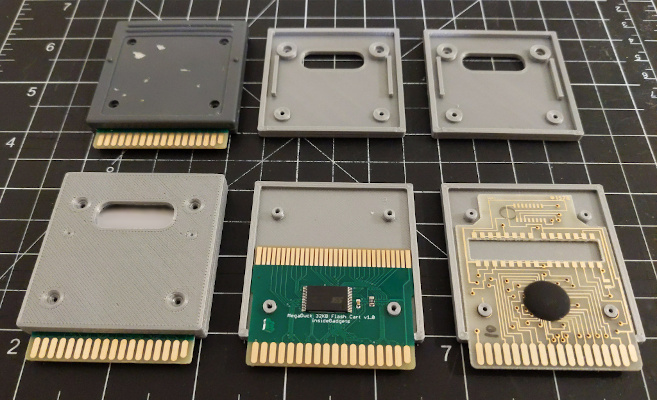
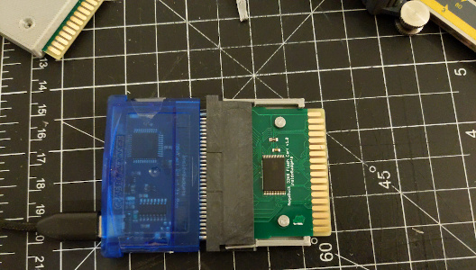

## 3D Printable Cartidge Shell for the Mega Duck Console

The [Mega Duck](https://en.wikipedia.org/wiki/Mega_Duck) / Cougar Boy is a (1993) hardware clone of the Game Boy with some register changes and a different cartridge format.

Until now there have been no aftermarket Cartridge Shells available for the Mega Duck. This 3D printable design can be used to avoid harvesting OEM shells for use with Flash Cartridge PCBs.

## Features:
- Compatible with OEM and Inside Gadgets Mega Duck cartidge PCBs
- Opens easily and parts remain aligned without screws for easier programming access during development
- Screws can be used to lock the top and bottom parts together

## GBXCart Programming Jig
An improved adapter jig for programming the Inside Gadgets cartridge with a gbxcart is also included in this repo.

## 3D Printing and Design
The design has been printed with success in PLA.

- Use the `.stl` files for printing (See Releases)
- Use the `.FCStd` files for modifying the design (FreeCAD 20.1)

## Screws
To avoid scratching the inside of the cartridge slot use screws with a pan head of ~1.2mm or less (so they fit completely within the screw hole recesses). 
Depending on the fidelity of the 3D print it may be necessary to slightly ream out the screw holes.

Compatible screws:
- [#21534 at MetricScrews.us](https://www.metricscrews.us/index.php?main_page=product_info&cPath=98_298_300&products_id=1248)
  - M1.7x3 Steel / Nickel Pan Head Phillips Machine Screw, Pan Head Height & Diameter: 1.1mm, 3.2mm
- [#20612 at MetricScrews.us](https://www.metricscrews.us/index.php?main_page=product_info&cPath=98_298_300&products_id=506)
  - M1.7-0.35 x 3.5mm C1018 / Steel / Nickel Pan Head Phillips Machine Screw, Pan Head Height & Diameter: 1.1mm, 3.2mm
  

## Available Flash Carts

### Inside Gadgets
Inside Gadgets sells a 32K Mega Duck flash cart with RAM and no MBC (~$9). It can be used with this cartridge shell design.
- Has a Game Boy cartridge connector on the other end so that it can be programmed with the a gbxcart.
- Cartridge: https://shop.insidegadgets.com/product/megaduck-32kb-flash-cart/
- GBXCart programmer: https://www.gbxcart.com/

### a2heaven
a2heaven.com sells a Multi-Cart (~$66) which comes in ready made shell, so no 3D Printed shell is required.
http://www.a2heaven.com/webshop/index.php?rt=product/product&product_id=172

## Development Tools
As of [GBDK-2020](https://github.com/gbdk-2020/gbdk-2020) 4.0.6 it is now possible to write software for the Mega Duck in C. 

